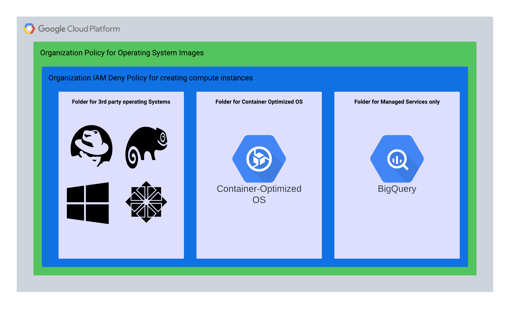

## Purpose
This module will address the customers who only want to use managed services and Google Kubernetes service, and not Compute service. This module will deploy the preventative and detective controls to the Google compute service can only be created by Google Kubernetes service agent with the Container Optimized OS. 

The resources/services/activations/deletions that this module will create/trigger are:

- Create an Organizational constraint for COS Images only with an exception of folder id where 3rd party operating systems can be deployed
- Create an Organizational constraint to Restrict Resource Service Usage to deny compute.googleapis.com
- Deploy a IAM Deny policy that only allows a list of service accounts to deploy compute instances

## Demo Architecture


## Documentation
- [Organizational Polict Constraints](https://cloud.google.com/resource-manager/docs/organization-policy/org-policy-constraints)
- [IAM Deny](https://cloud.google.com/resource-manager/docs/organization-policy/org-policy-constraints)
- [Operating System Images](https://cloud.google.com/compute/docs/images/os-details)

## Cost
- No costs

## Usage
1. Clone repo
```
git clone https://github.com/jasonbisson/terraform-google-cos-only.git

```

2. Rename and update required variables in terraform.tvfars.template
```
mv terraform.tfvars.template terraform.tfvars
#Update required variables
```
3. Execute Terraform commands with existing identity (human or service account) to build Vertex Workbench Infrastructure 

```
cd ~/terraform-google-cos-only/
terraform init
terraform plan
terraform apply
```

Functional examples are included in the
[examples](./examples/) directory.

<!-- BEGINNING OF PRE-COMMIT-TERRAFORM DOCS HOOK -->
## Inputs

| Name | Description | Type | Default | Required |
|------|-------------|------|---------|:--------:|
| bucket\_name | The name of the bucket to create | `string` | n/a | yes |
| project\_id | The project ID to deploy to | `string` | n/a | yes |

## Outputs

| Name | Description |
|------|-------------|
| bucket\_name | Name of the bucket |

<!-- END OF PRE-COMMIT-TERRAFORM DOCS HOOK -->
## Requirements

These sections describe requirements for using this module.

### Software

The following dependencies must be available:

- [Terraform][terraform] v0.13 or above
- [Terraform Provider for GCP][terraform-provider-gcp] plugin v3.0 or above

### Deployment Account

The account used for the deployment will require the following roles:
- Organizational Policy admin roles/orgpolicy.policyAdmin
- IAM Deny admin roles/iam.denyAdmin

### APIs
Since a project is created by the Project Factory module, you must activate the following APIs on the base project where the Service Account was created:
- cloudresourcemanager.googleapis.com 
- iam.googleapis.com

## Contributing

Refer to the [contribution guidelines](./CONTRIBUTING.md) for
information on contributing to this module.

[terraform-provider-gcp]: https://www.terraform.io/docs/providers/google/index.html
[terraform]: https://www.terraform.io/downloads.html

## Security Disclosures

Please see our [security disclosure process](./SECURITY.md).# terraform-google-cos-only
